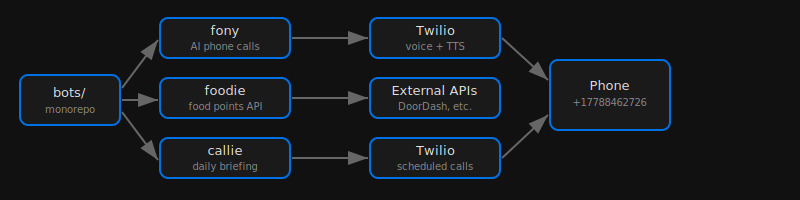

  
  <h1>bots</h1>

Monorepo for service automation bots.

## Architecture

## Subprojects

| Project | Description | Language |
|---------|-------------|----------|
| **fony** | AI phone calls via Twilio | Node.js |
| **food** | Master food bot -- Dominos ordering, Starbucks store finder, McDonald's menu, Chipotle, Taco Bell, Pizza Hut | Node.js |

## Roadmap

- [x] Dominos API integration (ordering, tracking, menu, store finder)
- [x] Dominos OAuth (rewards, profile)
- [x] OpenClaw CLI integration (order.js)
- [x] Starbucks store finder (public BFF endpoint)
- [x] McDonald's menu + nutrition lookup
- [x] Chipotle ordering (restaurant search, menu, ordering, pickup times)
- [x] Taco Bell ordering (location search, menu, cart, delivery estimates)
- [x] Pizza Hut ordering (store finder, menu, cart, session-based auth)
- [ ] Starbucks ordering (needs mitmproxy credential intercept)
- [x] Loyalty points + coupons tracking
- [x] Store deals from menu endpoint
- [x] Delivery instructions + tip config
- [ ] Notifications when rewards available
- [ ] Scheduled/recurring orders
- [ ] Order history and favorites

## License

MIT 2026

## Quick Commands
- `./scripts/simplify.sh` - normalize project structure
- `./scripts/monetize.sh . --write` - generate monetization plan (if available)
- `./scripts/audit.sh .` - run fast project audit (if available)
- `./scripts/ship.sh .` - run checks and ship (if available)
