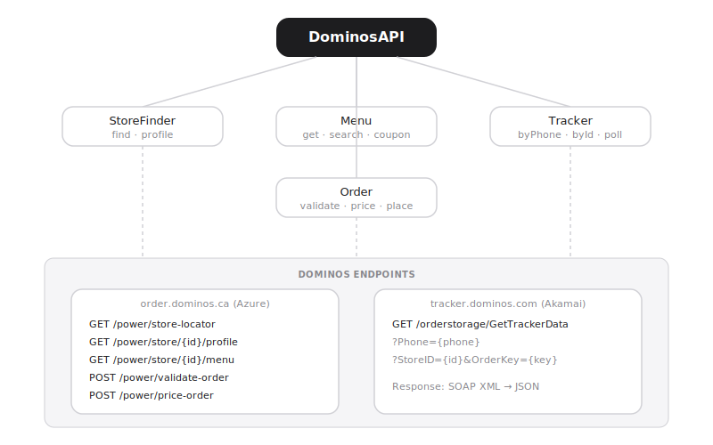

# Dominos Pizza API

Unofficial reverse-engineered Dominos Pizza API wrapper for Node.js. Zero dependencies — uses native `fetch`.

## Architecture



## Features

- **Store Finder** — Find nearby stores by address or postal code (US + Canada)
- **Menu Browser** — Full menu with categories, search, and coupon lookup
- **Order Tracker** — Track orders by phone number or order key in real-time
- **Order Builder** — Create, validate, price, and place orders programmatically

## Quick Start

```javascript
import { DominosAPI } from './dominos.js';

const api = new DominosAPI({ region: 'ca' }); // 'us' or 'ca'

// Find stores near an address
const stores = await api.stores.find('20690 40 Ave, Langley, BC');
console.log(stores[0].StoreID, stores[0].Phone);

// Browse the menu
const menu = await api.menu.get(stores[0].StoreID);

// Track an order
const tracker = await api.tracker.byPhone('6045342277');

// Build an order
const order = api.createOrder();
order
  .setAddress({ street: '20690 40 Ave', city: 'Langley', region: 'BC', postalCode: 'V3A2X7' })
  .setStore(stores[0].StoreID)
  .setCustomer({ firstName: 'Josh', lastName: 'D', email: 'j@test.com', phone: '6045342277' })
  .addProduct('14SCREEN')
  .addCoupon('9193');

const priced = await order.price();
console.log('Total:', priced.Order.Amounts.Customer);
```

## Demo

```bash
node demo.js                          # uses default Langley address
node demo.js "123 Main St, Vancouver" # custom address
```

## API Reference

| Module | Method | Description |
|--------|--------|-------------|
| `stores.find(address, type?)` | GET | Find stores near address. Type: `Delivery` or `Carryout` |
| `stores.profile(storeId)` | GET | Store hours, capabilities, contact info |
| `menu.get(storeId)` | GET | Full menu with products, sizes, toppings |
| `menu.coupon(storeId, couponId)` | GET | Coupon details |
| `Menu.searchItems(menu, query)` | — | Search menu products by name |
| `tracker.byPhone(phone)` | GET | Track all orders for a phone number |
| `tracker.byId(storeId, orderKey)` | GET | Track specific order |
| `tracker.poll(phone, interval, cb)` | — | Poll tracker until delivery complete |
| `order.setAddress(...)` | — | Set delivery address |
| `order.setStore(storeId)` | — | Set store |
| `order.addProduct(code, qty, opts)` | — | Add item to order |
| `order.validate()` | POST | Validate order with Dominos |
| `order.price()` | POST | Get pricing breakdown |
| `order.place(payment)` | POST | Place the order |

## Tracker Stages

Orders progress through: `Order Placed` → `Prep` → `Bake` → `Quality Check` → `Out for Delivery` → `Delivered`

## Notes

- No API key or auth needed for store/menu/tracker
- Order placement requires real address + payment
- Canadian stores use `order.dominos.ca`, US uses `order.dominos.com`
- Rate limits unknown — use 30s polling intervals for tracker
- Rewards/loyalty API requires session auth (not implemented)

## Project Map

```svg
<svg viewBox="0 0 680 420" width="680" height="420" xmlns="http://www.w3.org/2000/svg" style="font-family:monospace;background:#f8fafc;border-radius:12px">
  <rect width="680" height="420" fill="#f8fafc" rx="12"/>
  <text x="340" y="28" text-anchor="middle" font-size="13" font-weight="bold" fill="#1e293b">dominos — unofficial Dominos Pizza API wrapper · Node.js · zero deps</text>

  <!-- Root node -->
  <rect x="270" y="45" width="140" height="34" rx="8" fill="#0071e3"/>
  <text x="340" y="67" text-anchor="middle" font-size="11" fill="white">dominos/</text>

  <!-- Dashed lines from root -->
  <line x1="340" y1="79" x2="110" y2="140" stroke="#94a3b8" stroke-width="1.2" stroke-dasharray="4,3"/>
  <line x1="340" y1="79" x2="260" y2="140" stroke="#94a3b8" stroke-width="1.2" stroke-dasharray="4,3"/>
  <line x1="340" y1="79" x2="400" y2="140" stroke="#94a3b8" stroke-width="1.2" stroke-dasharray="4,3"/>
  <line x1="340" y1="79" x2="530" y2="140" stroke="#94a3b8" stroke-width="1.2" stroke-dasharray="4,3"/>
  <line x1="340" y1="79" x2="620" y2="140" stroke="#94a3b8" stroke-width="1.2" stroke-dasharray="4,3"/>

  <!-- dominos.js — core -->
  <rect x="60" y="140" width="100" height="34" rx="6" fill="#e0e7ff"/>
  <text x="110" y="157" text-anchor="middle" font-size="11" fill="#3730a3">dominos.js</text>
  <text x="110" y="168" text-anchor="middle" font-size="9" fill="#64748b">core API client</text>

  <!-- test.js -->
  <rect x="210" y="140" width="100" height="34" rx="6" fill="#dcfce7"/>
  <text x="260" y="157" text-anchor="middle" font-size="11" fill="#166534">test.js</text>
  <text x="260" y="168" text-anchor="middle" font-size="9" fill="#64748b">integration tests</text>

  <!-- package.json -->
  <rect x="350" y="140" width="100" height="34" rx="6" fill="#e0f2fe"/>
  <text x="400" y="157" text-anchor="middle" font-size="11" fill="#0369a1">package.json</text>
  <text x="400" y="168" text-anchor="middle" font-size="9" fill="#64748b">zero deps · native fetch</text>

  <!-- index.html -->
  <rect x="480" y="140" width="100" height="34" rx="6" fill="#fef3c7"/>
  <text x="530" y="157" text-anchor="middle" font-size="11" fill="#92400e">index.html</text>
  <text x="530" y="168" text-anchor="middle" font-size="9" fill="#64748b">demo UI</text>

  <!-- README -->
  <rect x="580" y="140" width="80" height="34" rx="6" fill="#dcfce7"/>
  <text x="620" y="157" text-anchor="middle" font-size="11" fill="#166534">README.md</text>
  <text x="620" y="168" text-anchor="middle" font-size="9" fill="#64748b">API docs</text>

  <!-- dominos.js internals — API modules -->
  <line x1="110" y1="174" x2="80" y2="240" stroke="#94a3b8" stroke-width="1"/>
  <line x1="110" y1="174" x2="180" y2="240" stroke="#94a3b8" stroke-width="1"/>
  <line x1="110" y1="174" x2="280" y2="240" stroke="#94a3b8" stroke-width="1"/>
  <line x1="110" y1="174" x2="380" y2="240" stroke="#94a3b8" stroke-width="1"/>

  <rect x="30" y="240" width="100" height="40" rx="6" fill="#e0e7ff"/>
  <text x="80" y="257" text-anchor="middle" font-size="10" fill="#3730a3">stores</text>
  <text x="80" y="268" text-anchor="middle" font-size="9" fill="#64748b">find / profile</text>
  <text x="80" y="278" text-anchor="middle" font-size="9" fill="#64748b">nearby stores</text>

  <rect x="130" y="240" width="100" height="40" rx="6" fill="#e0e7ff"/>
  <text x="180" y="257" text-anchor="middle" font-size="10" fill="#3730a3">menu</text>
  <text x="180" y="268" text-anchor="middle" font-size="9" fill="#64748b">get / coupon</text>
  <text x="180" y="278" text-anchor="middle" font-size="9" fill="#64748b">product search</text>

  <rect x="230" y="240" width="100" height="40" rx="6" fill="#e0e7ff"/>
  <text x="280" y="257" text-anchor="middle" font-size="10" fill="#3730a3">tracker</text>
  <text x="280" y="268" text-anchor="middle" font-size="9" fill="#64748b">byPhone / byId</text>
  <text x="280" y="278" text-anchor="middle" font-size="9" fill="#64748b">poll until delivered</text>

  <rect x="330" y="240" width="100" height="40" rx="6" fill="#e0e7ff"/>
  <text x="380" y="257" text-anchor="middle" font-size="10" fill="#3730a3">order</text>
  <text x="380" y="268" text-anchor="middle" font-size="9" fill="#64748b">validate / price</text>
  <text x="380" y="278" text-anchor="middle" font-size="9" fill="#64748b">place order</text>

  <!-- Order stages -->
  <line x1="380" y1="280" x2="200" y2="340" stroke="#94a3b8" stroke-width="1"/>
  <line x1="380" y1="280" x2="310" y2="340" stroke="#94a3b8" stroke-width="1"/>
  <line x1="380" y1="280" x2="420" y2="340" stroke="#94a3b8" stroke-width="1"/>
  <line x1="380" y1="280" x2="530" y2="340" stroke="#94a3b8" stroke-width="1"/>

  <rect x="150" y="340" width="100" height="32" rx="6" fill="#fef3c7"/>
  <text x="200" y="357" text-anchor="middle" font-size="10" fill="#92400e">Order Placed</text>
  <text x="200" y="368" text-anchor="middle" font-size="9" fill="#64748b">→ Prep</text>

  <rect x="260" y="340" width="100" height="32" rx="6" fill="#fef3c7"/>
  <text x="310" y="357" text-anchor="middle" font-size="10" fill="#92400e">Bake</text>
  <text x="310" y="368" text-anchor="middle" font-size="9" fill="#64748b">→ QC Check</text>

  <rect x="370" y="340" width="100" height="32" rx="6" fill="#fef3c7"/>
  <text x="420" y="357" text-anchor="middle" font-size="10" fill="#92400e">Out for Delivery</text>

  <rect x="480" y="340" width="100" height="32" rx="6" fill="#dcfce7"/>
  <text x="530" y="357" text-anchor="middle" font-size="10" fill="#166534">Delivered</text>
  <text x="530" y="368" text-anchor="middle" font-size="9" fill="#64748b">complete</text>

  <!-- Tech labels -->
  <text x="340" y="405" text-anchor="middle" font-size="9" fill="#64748b">Node.js · native fetch · no auth · US + CA regions · order.dominos.ca / .com</text>
</svg>
```
