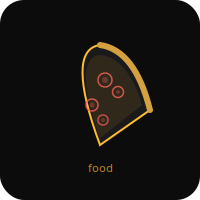

# Food


Unified food API — 8 chains, one module (`food.js`).

## Services

| Service | Status | Store Search | Menu | Ordering |
|---------|--------|-------------|------|---------|
| **Dominos** | Live | ✅ | ✅ | ✅ Full pipeline |
| **Starbucks** | Partial | ✅ | ✅ | ❌ Needs API creds |
| **McDonald's** | Live | ❌ | ✅ Static | ❌ |
| **Chipotle** | Live | ✅ | ✅ | ✅ |
| **Taco Bell** | Live | ✅ | ✅ | ✅ |
| **Pizza Hut** | Live | ✅ (zip) | ✅ | ✅ |
| **Firehouse Subs** | Partial | ✅ US only | ✅ Static | ❌ Needs Cognito auth |
| **Dairy Queen** | Partial | ✅ | ✅ Static | ❌ |

## Unified Interface

Every class implements:
```js
searchStores(lat, lng, radius)  // live API or throws if unavailable
getMenu()                        // live or static
searchMenu(query)                // fuzzy search across all categories
getPrice(itemId, size)           // returns number or null
```

## Health Check

```bash
node health.js
```

## OpenClaw Integration

CLI wrapper: `~/.openclaw/workspace/skills/dominos/scripts/order.js`

```bash
node order.js usual         # Price the usual order + Opticon balance preflight
node order.js place         # Place order
node order.js menu <query>  # Search menu
node order.js track         # Track delivery
node order.js stores <addr> # Find nearby stores
node order.js loyalty       # Check points
node order.js coupons       # Coupons
```

## Dominos Purchase Guard

The OpenClaw Domino's wrapper now includes a purchase preflight before ordering:
- reads saved Opticon balance first
- computes purchase as a percent of available balance
- includes store-status preflight when available
- emits a cleaner receipt after placement

This makes the default order flow:
`balance -> percent -> store check -> price -> confirm -> place -> receipt/track`

## Dominos Defaults

- Store: 10090 (Langley)
- Usual: Large hand tossed, pepperoni + bacon, 2x garlic dip
- Delivery: leave at door, tip $0
- Payment: Mastercard from `~/.openclaw/.secure/payment.env`

## License

MIT 2026
