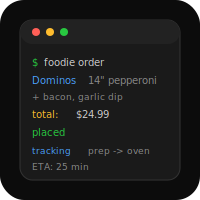

# Foodie


Food ordering automation for Dominos, Chipotle, Starbucks, McDonald's.

## Features

### Dominos 🍕
- **Quick ordering**: `usual` → 14" hand-tossed, pepperoni+bacon, garlic dip
- **Custom pizzas**: `pepperoni bacon`, `veggie`, etc.
- **Real-time tracking**: SMS notifications via `tracker.dominos.com`
- **Store finder**: Auto-detects nearest Dominos (Langley store: 10090)
- **Payment**: Integrated with saved Mastercard

### Chipotle 🌯
- **Bowl builder**: `bowl chicken guac` 
- **Burrito orders**: `burrito carnitas rice:brown`
- **Store locator**: Auto-finds nearest location
- **SMS confirmations**: Pickup codes & ETAs

### SMS Integration
- Order parsing from natural language
- Order confirmations with totals & ETAs
- Real-time status tracking
- Delivery notifications

## Usage

### Via OpenClaw Handler

```bash
/food dominos usual                  # Josh's usual order
/food dominos pepperoni bacon        # Custom pizza
/food dominos 14 veggie              # Size + toppings
/food status tracker                 # Show tracker link
/food status <phone>                  # Track by phone
```

### Programmatically

```javascript
import { DominosAPI, DominosOrderParser } from './src/dominos.js';
import { OpenClawFoodHandler } from './src/openclaw-handler.js';

// Quick order
const handler = new OpenClawFoodHandler();
const result = await handler.execute(['dominos', 'usual']);
console.log(result);

// Manual API
const api = new DominosAPI();
const parsed = DominosOrderParser.parse('pepperoni bacon');
const order = await api.createOrder(parsed);
const pricing = await api.priceOrder(order);
```

## Configuration

### Josh's Default Order
```javascript
{
  size: '14SCREEN',           // 14" hand-tossed
  toppings: ['P', 'K'],       // Pepperoni, bacon
  sauce: 'X',                 // Extra garlic
  sides: [{ code: 'GARBUTTER' }], // Garlic dip
  store: 10090,               // Langley, BC
}
```

### Payment
Requires card data in environment:
- `CARD_NUMBER` — Mastercard (stored securely)
- `CARD_EXP` — Expiration MM/YY
- `CARD_CVV` — Security code
- `CARD_POSTAL` — Postal code

### SMS Notifications
Register callback:
```javascript
const handler = new FoodOrderHandler();
handler.onSms((type, data) => {
  // Send SMS via Twilio, etc.
  console.log(`[SMS] ${type}:`, data.message);
});
```

## Files

| File | Purpose |
|------|---------|
| `src/dominos.js` | Dominos API wrapper & order parser |
| `src/dominos-sms.js` | SMS notifications & tracking |
| `src/openclaw-handler.js` | `/food` command handler |
| `src/sms-handler.js` | Multi-restaurant orchestration |
| `src/chipotle.js` | Chipotle API integration |
| `src/tacobell.js` | Taco Bell API (coming) |

## Architecture

```
OpenClaw (/food command)
    ↓
openclaw-handler.js (route to restaurant)
    ↓
dominos.js (DominosAPI)
    ├─ createOrder(parsed)
    ├─ priceOrder(order)
    └─ placeOrder(order, payment)
    ↓
dominos-sms.js (DominosSmsNotifier)
    ├─ notifyOrderPlaced()
    ├─ notifyOrderStatus()
    └─ startTracking()
    ↓
SMS/iMessage
```

## Dependencies

- `dominos` (v3.3.1) — Dominos API client
- `axios` (v1.13.6) — HTTP requests

## Testing

```bash
node test-dominos.js
npm test
```

## Next Steps

- [ ] Payment card encryption (PCI-DSS)
- [ ] Starbucks integration (menu + ordering)
- [ ] McDonald's menu lookup
- [ ] Delivery time predictions
- [ ] Order history & saved favorites
- [ ] Multi-location support

---

MIT License
