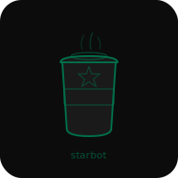

# Starbot


Starbucks CLI for store lookup, card balance checks, and rewards tracking.

## Usage

```bash
starbot stores "Seattle, WA"
starbot balance --card 1234567890123456 --pin 1234
starbot reload --amount 25
```

## Programmatic API

```js
import { StarbotAPI } from './starbot.js';
const api = new StarbotAPI();
const result = await api.cardBalance('1234567890123456', '1234');
```

## Status

Starbucks deprecated public BFF endpoints in early 2026. Methods currently throw until OAuth tokens (via mitmproxy) or Puppeteer scraping is added.

## License

MIT 2026 Joshua Trommel
